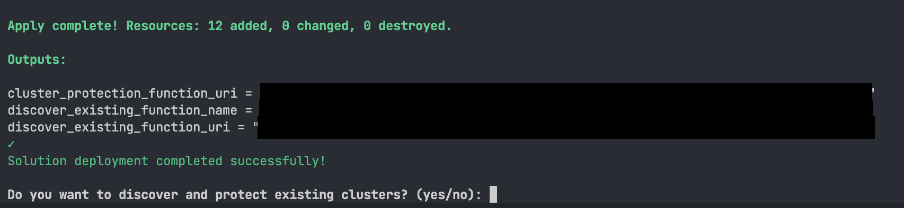

<p align="center">
   
</p>

# GCP GKE Protection

GCP GKE Protection is a solution that can be used to deploy the Falcon Operator, Falcon Admission Controller, and Falcon Node Sensors on all applicable GKE clusters in an automated fashion.

## Table of Contents

- [Architecture](#architecture)
  - [Deployed Resources](#deployed-resources)
  - [Automation Workflow](#automation-workflow)
- [Prerequisites](#prerequisites)
  - [CrowdStrike](#crowdstrike)
  - [GCP](#gcp)
- [Deployment](#deployment)
  - [Deployment Scopes](#deployment-scopes)
  - [Execution](#execution)
  - [Existing Cluster Discovery Post Deployment](#triggering-existing-cluster-discovery-post-deployment)
- [Contributing](#contributing)
- [Support](#support)
- [License](#license)

## Architecture

### Deployed Resources

The solution resources are built and managed through Terraform. The terraform templates create the following resources:

#### Asset Feed Resources
>
> [!NOTE]
> Only one of the following resources will be deployed depending on scope you choose.

- ***crowdstrike-gke-protection-organization-feed*** - Monitors GKE cluster events at organization level
- ***crowdstrike-gke-protection-project-feed*** - Monitors GKE cluster events at project level
- ***crowdstrike-gke-protection-folder-feed*** - Monitors GKE cluster events at folder level

#### Cloud Functions

- ***gke-protection-cluster-protection-function-[`random-hex`]*** - Cloud Function that discovers and installs Falcon sensor on Kubernetes clusters
- ***gke-protection-discover-existing-function-[`random-hex`]*** - Cloud Function that discovers existing GKE clusters

#### Storage Resources

- ***[`random-hex`]-gke-protection-source*** - Cloud Storage bucket that stores function source code

#### Pub/Sub Resources

- ***crowdstrike-gke-protection-feed-topic*** - Pub/Sub topic that receives asset change notifications

#### IAM Bindings

- ***Cloud Run Invoker role (`roles/run.invoker`)*** - Granted to allUsers for both Cloud Functions
- ***Pub/Sub Publisher role (`roles/pubsub.publisher`)*** - Granted to specified service account

### Automation Workflow

The automation is broken into two parts; **Cluster Discovery** and **Cluster Protection**.

#### Cluster Discovery

This function can be triggered after the initial deployment, or on demand by sending a message to the function endpoint. The automation discovers existing clusters within a given scope, and send a payload with the cluster name to the pub/sub topic the Cluster Protection function is subscribed to.

#### Cluster Protection

This function is triggered when a new gke cluster is created and a en event from the asset feed is sent to the pub/sub topic the function is subscribed to.
The automation first tries to find an retrieve the cluster metadata. Once the metadata is retrieved, the automation waits until the cluster is in a ready state, and creates a kubeconfig and connects to the cluster. The automation first checks to see if the kubernetes operator namespace is already created and there are pods actively running, if this is the case it skips deploying the operator, otherwise the operator is deployed. It then checks to see if there is `FalconDeployment` resource deployed, if not, it deployed the FalconDeployment CRD configured with your Falcon ClientID and ClientSecret.

## Prerequisites

### CrowdStrike

#### Provision Credentials

API credentials with the following scopes need to be created

- Falcon Container Image (Read)
- Falcon Images Download (Read)

### GCP

#### Enable APIs

The following APIs need to be enabled.

- Cloud Functions
- Cloud Asset
- Pub Sub

> [!Tip]
> Enable all APIs by clicking [this URL](https://console.cloud.google.com/apis/enableflow?apiid=cloudfunctions.googleapis.com,cloudresourcemanager.googleapis.com,pubsub.googleapis.com,cloudasset.googleapis.com,cloudbuild.googleapis.com,eventarc.googleapis.com,run.googleapis.com&redirect=https:%2F%2Fcloud.google.com)

#### Provision Service Account

A service account needs to be created. The service account must have the following roles at the *Scope* you want to be protected.

- Cloud Asset Viewer
- Kubernetes Engine Admin
- Cloud Run Jobs Executor

## Deployment

### Deployment Scopes

Identify at what scope you want to protect your GKE clusters

- **Organization**: Will discover and protect clusters for all projects within a given organization
- **Folder**: Will discover and protect clusters for all projects within a given folder
- **Project**: Will discover and protect clusters for a given project

### Execution

Start the deployment process by executing the following command in the root directory of this repository

```shell
./install.sh
```

The script will ask you for a series of values:

- **DEPLOYMENT_PROJECT_ID** - Account solution should be deployed in
- **FALCON_CLIENT_ID** - Client ID for falcon api
- **FALCON_CLIENT_SECRET** - Client Secret for falcon api
- **LOCATION** - GCP location to deploy to
- **SERVICE_ACCOUNT_EMAIL** - Email of the service account that has required roles
- **SCOPE** - Chose deployment scope. Must be one of `projects`, `folders`, `organizations`
- **SCOPE_IDENTIFIER** - you will need to supply one of the following values depending on the scope selected
  - organizations: organization id
  - folders: folder id
  - projects: project id, or project name

The script will validate that the required APIs have been enabled and then deploy the terraform template to build out the resources required fro cluster protection. If everything is successful, you should see a message at the end similar to this.



#### Post Execution

The install script will ask you if you want to discover and protect existing clusters. If you select yes, it will scan all projects within the scope chose to find clusters that were created prior to deploying te solution, and initiate cluster protection.

### Triggering Existing Cluster Discovery Post Deployment

If you choose not to protect existing clusters, you can trigger it by executing

```shell
./protect_existing.sh <deployment-region> <deployment-project>
```

## Contributing

Contributions are welcome! Please read our [Contributing Guide](https://github.com/CrowdStrike/community/blob/1563cc7f54ed6426f5cc15ae22c8c2636c06885f/docs/contributing.md) for details on how to submit pull requests.

## Support

For additional support, please see the [SUPPORT.md](SUPPORT.md) file.

## License

This project is licensed under the [MIT License](LICENSE).
